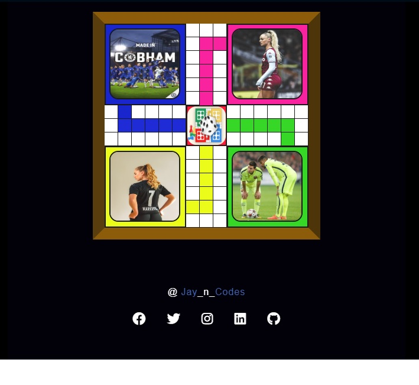

# Ludo Game frame Design

## Overview

- Built this porpular Nigerian game (ludo) while attempting to work my hands out on CSS.
- Because I'm a sole believer of "learn more by practice" 😄.
- Had this made with CSS.

### PS: There's no use of CSS flexbox or grid model on this piece of work 😎.

- I didn't create a mobile display for this Perhaps you can try working that out?.

## Built with

- HTML
- CSS

Preview

## Link(s)

Live preview : [https://emmyjoel.github.io/Ludo-design/]

## Let's Link up on socials 😃

- Twitter : [https://www.twitter.com/Jay_n_Codes/]
- LinkedIn : [https://www.linkedin.com/in/emmanuel-okhuoya-735576238]